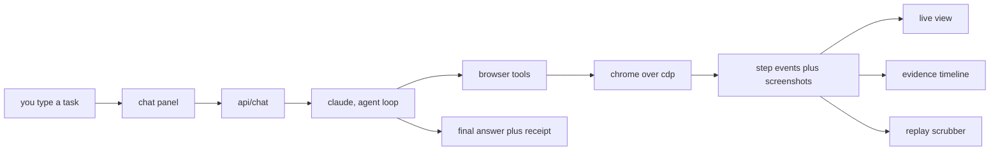

<div align="center">


# sentry

**an agent that drives a real browser for you, and shows its work.**

you type a task in plain english. sentry opens a real chrome, clicks around, reads pages, and comes back with an answer. every step is on screen while it happens, and you can scrub back through it after. nothing is hidden.

**▶ [watch the 2-min demo (voice narrated)](https://drive.google.com/file/d/1iZz6PNH8cZWmfuI7-f7FfToDq_3mQoj5/view?usp=sharing)** · **[try it live](https://ai-sdk-computer-use-theta-dun.vercel.app/)**

[demo video](#demo) · [how it works](#how-it-works) · [what it does](#what-it-does) · [run it locally](#run-it-locally) · [layout](#project-layout)

</div>

---

## demo

**[▶ watch the full walkthrough (voice narrated) →](https://drive.google.com/file/d/1iZz6PNH8cZWmfuI7-f7FfToDq_3mQoj5/view?usp=sharing)**

a ~2 minute walkthrough with voice narration, covering the whole story end to end:

- **the rebuild** — why sentry moved from a vnc desktop agent to a browser-first engine
- **live task** — asking it for the weather in dubai and watching a real chrome do the work, step by step
- **the evidence** — scrubbing back through a run, screenshot by screenshot, to audit exactly what it did
- **isolated sessions** — a second task in a fresh session, with the first run's history fully intact
- **transparency** — the debug panel: every event, its status, and how long it took

| link | what it is |
|---|---|
| **[demo video](https://drive.google.com/file/d/1iZz6PNH8cZWmfuI7-f7FfToDq_3mQoj5/view?usp=sharing)** | full voice-narrated walkthrough |
| **[live app](https://ai-sdk-computer-use-theta-dun.vercel.app/)** | open it and run your own task |
| **[source](https://github.com/MiirzaBaig/ai-agent)** | this repo |

---

## the short version

this project has lived two lives.

**before.** the first build (about 8 months ago) was a computer-use agent. it ran a full linux desktop inside a cloud sandbox, streamed the whole screen back over vnc, and moved a mouse pixel by pixel. it worked, but it was heavy. you were watching a video of a desktop, screenshots were the only way the model could "see," and every action meant another full-frame image round trip. slow, pricey, and hard to trust because you could not really tell *why* it clicked where it clicked.

**now.** sentry is a browser-first agent. instead of pushing pixels around a desktop, it talks to chrome directly at the dom level. six small tools: `navigate`, `click`, `type`, `read`, `screenshot`, `goBack`. it reads the actual text of a page instead of squinting at a picture of it, so it is faster, cheaper, and its choices make sense. you still get a live view of the browser, but now it sits next to a running record of every step, with a screenshot pinned to each one. same product idea, taken through two full generations of the engine underneath.

that is the story worth telling. not "i built a demo," but "i built it, learned where the arch hurt, and rebuilt the core."

|  | before | now |
|---|---|---|
| **engine** | full linux desktop in a sandbox | real chrome, driven at the dom level |
| **how it sees** | screenshots only | reads page text first, pixels on demand |
| **how it acts** | mouse moves, pixel by pixel | clicks real elements by their text |
| **the view** | a video stream of a desktop | live browser plus a step by step record |
| **trust** | hard to tell why it clicked | every step logged, screenshotted, replayable |
| **feel** | heavy and slow | fast, cheap, legible |

---

## how it works



the browser runs on **browserbase** in production, so the public link just works, and on a **local chrome** in dev, so you can watch it move. the app picks the right one from the environment and the rest of the code never has to care.

the flow, in plain terms:

1. **you ask.** a task goes to `api/chat`, which runs an agent loop on claude with a capped step budget.
2. **it acts.** each turn the model picks one of six dom tools. every tool call comes back with the current url, the page title, and the visible text, so the model decides the next move from real signal, not a guess.
3. **it reads before it looks.** reading page text is the default because it is faster and cheaper. a screenshot only happens when something actually needs to be seen.
4. **you watch.** the browser shows up live while it runs, right next to the chat.
5. **you get proof.** every step lands on a timeline with a screenshot attached. when the run ends you get a clean answer up top plus a receipt you can save, copy, or share.

the whole thing is built so a stranger can open the link, run a task, and trust what they saw, without reading a single line of code.

---

## what it does

**drives a real browser.** navigate, click by visible text, type into fields, submit forms, go back. it works on live sites, not a mock.

**reads pages the smart way.** text first, pixels only when needed. that one choice is most of why it feels quick.

**shows every step, live.** a running browser view sits right next to the chat. you are never guessing what it is doing.

**keeps the receipts.** each step is recorded with a screenshot. scrub the timeline like a video, or open any step to see exactly what happened.

**knows when to stop.** it avoids captchas, login walls, and cookie gates instead of banging on them. if a source is blocked it picks another. if it truly cannot finish, it says so and tells you what it found anyway.

**runs on your pick of model.** switch between opus 4.8, sonnet 5, and haiku 4.5 from the header. cost and token use are tracked live so you can see the trade.

**remembers your sessions.** create, switch, and delete runs. history and evidence persist per session in the browser.

**works on your phone.** the live view, timeline, and per-message actions all fold down to a touch layout.

---

## why it is built this way

**dom over pixels.** the biggest lesson from the first build. a computer-use desktop is general but blunt. for web tasks, talking to chrome directly is faster, cheaper, and far easier to reason about. the model reads real text and clicks real elements, so its behavior is legible.

**evidence is a feature, not an afterthought.** an agent you cannot audit is an agent you cannot trust. so every step is captured and replayable by default. the receipt at the end is the point, not a nice-to-have.

**two browser backends, one code path.** browserbase in the cloud so the public link just works, local chrome in dev so you can watch and debug. the app picks the right one from the environment, and the rest of the code does not care which.

**typed events end to end.** every action becomes a typed event with a status and a screenshot. the ui is just a view over that stream, which keeps the live view, timeline, and replay all in sync with zero guessing.

**small, sharp tool surface.** six tools, not sixty. fewer moving parts means the agent loop is easy to follow and hard to break.

---

## run it locally

**you need**

- node 18 or newer
- an anthropic api key with credits
- optional: a browserbase key, only if you want the cloud browser locally. by default local dev opens your own chrome.

**steps**

```bash
git clone https://github.com/MiirzaBaig/ai-agent.git
cd ai-agent
npm install
```

drop a `.env.local` in the root:

```env
ANTHROPIC_API_KEY=your_key_here

# optional, for the cloud browser
BROWSERBASE_API_KEY=your_key_here
BROWSERBASE_PROJECT_ID=your_project_id_here
```

then:

```bash
npm run dev
```

open http://localhost:9005 and give it a task. try something like *"find the top 3 headlines on hacker news right now"* and watch it go.

**build for prod**

```bash
npm run build
npm start
```

---

## project layout

```
ai-agent/
├── app/
│   ├── api/
│   │   ├── chat/               # the agent loop
│   │   ├── browser-live-view/  # live view url for the running browser
│   │   ├── get-desktop/        # start a browser session
│   │   └── kill-desktop/       # tear it down
│   ├── layout.tsx
│   └── page.tsx                # the two-panel dashboard
├── components/
│   ├── ChatPanel.tsx           # chat, streaming, per-message actions
│   ├── LiveFilmstrip.tsx       # live browser view
│   ├── EvidenceTimeline.tsx    # every step, with screenshots
│   ├── ReplayScrubber.tsx      # scrub back through a run
│   ├── AgentActivity.tsx       # what the agent is doing right now
│   ├── SessionList.tsx         # sessions
│   ├── SessionTelemetry.tsx    # live cost + token use
│   ├── ModelSelector.tsx       # opus / sonnet / haiku switch
│   └── MessageActions.tsx      # copy, copy + sources, share, retry
├── lib/
│   ├── browser/
│   │   ├── session.ts          # chrome over cdp, browserbase or local
│   │   └── tools.ts            # navigate, click, type, read, screenshot, goBack
│   ├── events/                 # typed event stream + hooks
│   ├── sessions/               # session store
│   ├── models.ts               # model registry + pricing
│   └── token-limits.ts         # graceful token-limit handling
└── README.md
```

---

## built with

- [next.js 15](https://nextjs.org) app router and [react 19](https://react.dev)
- [typescript](https://www.typescriptlang.org), typed end to end
- [claude](https://www.anthropic.com) for the agent, via the [vercel ai sdk](https://sdk.vercel.ai)
- [playwright over cdp](https://playwright.dev) to drive chrome
- [browserbase](https://browserbase.com) for the cloud browser in production
- [tailwind](https://tailwindcss.com) with a neo-brutalist styling pass

---

<div align="center">

built by **mirza baig**

[portfolio](https://persona-t82m.vercel.app/) · [linkedin](https://www.linkedin.com/in/mirza-baig-590b1826b/) · [github](https://github.com/MiirzaBaig)

</div>
